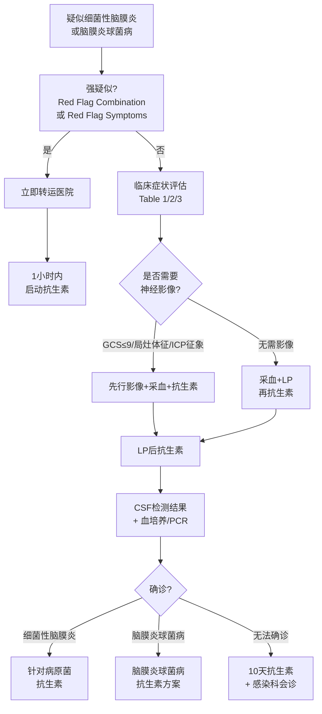

# 识别与诊断

## 本章目录

- [[NICE-BacM-0-概述]]
- [[NICE-BacM-2-院前转运]]
- [[NICE-BacM-4-抗生素]]
- [[NICE-BacM-5-脑球抗生素]]

---

## 🔬 1.1 概述：识别要点

> [!important] 关键认知
> 细菌性脑膜炎和脑膜炎球菌病是**进展迅速**的疾病，症状和体征可能不典型，年轻成人可能"看起来还好"，脑膜炎和脓毒症可同时出现（尤其有皮疹时）。

> [!tip] 识别原则
> 完成症状、体征和危险因素的全面评估，参考：
> - 细菌性脑膜炎强疑似标准（含 Red Flag Combination）
> - 脑膜炎球菌病强疑似标准（含 Red Flag Symptoms）
> - 家属/照护者提供的症状报告

> [!note] 特殊人群
> 对于意识障碍或沟通困难的患者，向家属/照护者了解近期症状变化。

---

## 🚨 2. 细菌性脑膜炎强疑似（Red Flag Combination）

> [!quote] 强推荐（Rec 1.1.4）
> 同时出现以下**全部四项**症状时，**强疑似细菌性脑膜炎**：
> - **发热**
> - **头痛**
> - **颈强直**
> - **意识或认知改变**（包括意识混乱或谵妄）

> [!warning] 临床边界
> 即使不完全具备 Red Flag Combination 四项，临床评估仍可强疑似细菌性脑膜炎（Rec 1.1.5）。

### 2.1 不同人群的症状体征表

> [!faq]- Table 1：婴儿、儿童和年轻人的症状体征

| 类别 | 症状/体征 | 备注 |
|------|----------|------|
| **Red Flag Combination** | 发热 + 头痛 + 颈强直 + 意识/认知改变 | 发热和颈强直在婴儿中可能不易识别 |
| **外观** | 囟门膨隆 | 仅见于婴儿和幼儿 |
| **行为** | 易激惹、无力高音调哭声 | 婴儿常见 |
| **心血管** | 脓毒症早期征象/休克体征 | 参见脑膜炎球菌病Table 3 |
| **神经系统** | 意识改变、局灶神经缺陷、头痛、颈强直、畏光、癫痫 | — |
| **呼吸系统** | 呼吸急促、呼吸暂停、呻吟 | 非特异性 |
| **皮疹** | 不可压之瘀点/紫癜样皮疹 | 主要见于脑膜炎球菌病 |

> [!faq]- Table 2：成人的症状体征

| 类别 | 症状/体征 | 备注 |
|------|----------|------|
| **Red Flag Combination** | 发热 + 头痛 + 颈强直 + 意识/认知改变 | 老年人发热可不明显 |
| **外观** | 面色苍白、皮肤大理石样改变或发绀 | 深肤色皮肤上可能难以察觉 |
| **行为** | 意识混乱、行为异常 | 老年人脑膜炎可能被漏诊 |
| **神经系统** | 意识改变、局灶神经缺陷、头痛、颈强直、畏光、癫痫 | — |
| **皮疹** | 不可压之瘀点/紫癜样皮疹 | 主要见于脑膜炎球菌病 |

---

## ⚠️ 3. 危险因素（Rec 1.1.8）

> [!important] 高危人群
> 以下人群需高度警惕细菌性脑膜炎（含脑膜炎球菌性脑膜炎）：

| 危险因素 | 说明 |
|---------|------|
| 免疫接种缺失 | 脑膜炎球菌、Hib、肺炎球菌疫苗缺失 |
| 脾功能缺失或减退 | — |
| 先天性补体缺乏或获得性抑制 | — |
| 大专院校学生 | 群居宿舍环境 |
| 脑膜炎球菌病家族史 | — |
| 接触史 | 与脑膜炎球菌病患者或疫区接触 |
| 既往病史 | 曾患细菌性脑膜炎或脑膜炎球菌病 |
| 脑脊液漏 | — |
| 耳蜗植入物 | — |

---

## 🩸 4. 脑膜炎球菌病强疑似（Red Flag Symptoms，Rec 1.1.9）

> [!quote] 强推荐
> 出现以下任一 **Red Flag Symptoms** 立即强疑似脑膜炎球菌病：
> - **≥ 2 mm 的出血性不可压之皮疹（紫癜）**
> - **迅速进展和/或扩散的不可压之瘀点或紫癜样皮疹**
> - **任何脑膜炎症状/体征** + **不可压之瘀点或紫癜样皮疹**

> [!warning] 不要除外
> 即使没有皮疹，**也不得排除**脑膜炎球菌病（Rec 1.1.10）。

### 4.1 皮疹识别要点（Rec 1.1.12）

| 要点 | 说明 |
|------|------|
| 全面检查 | 全身（含尿布区），检查结膜瘀点 |
| 深肤色皮肤 | 皮疹可能难以察觉，重点查结膜 |
| 皮疹变化 | 告知患者/照护者皮疹可从可压变为不可压，发生变化需返院 |

### 4.2 脑膜炎球菌病症状体征表（Table 3）

| 类别 | 症状/体征 | 备注 |
|------|----------|------|
| **Red Flag** | ≥2mm紫癜、迅速扩散的不可压皮疹、脑膜炎+不可压皮疹 | 立即处理 |
| **外观** | 状态差、面色苍白/大理石样/发绀 | — |
| **行为** | 嗜睡/无法唤醒、行为异常、高音调哭声 | — |
| **心血管** | 四肢冰冷、婴儿心率<60次/分、高龄特异性心率加快、低血压 | 参考年龄特异性标准 |
| **水合** | 毛细血管再充盈时间≥3秒、尿量减少 | — |
| **神经系统** | 意识改变、意识混乱 | 老年人可能漏诊 |
| **呼吸** | 呻吟（婴儿）、呼吸急促 | — |
| **其他** | 腹痛、腹泻、腿痛 | — |

---

## 🏥 5. 医院检查流程

### 5.1 关键时间节点

> [!danger] 核心要求
> 到达医院后 **1小时内** 启动抗生素（Rec 1.4.1 / 1.5.1）。

> [!note] 检查原则
> 血液检查和腰椎穿刺在启动抗生素**之前**完成（安全情况下）。

### 5.2 血液检查

| 检查项目 | 细菌性脑膜炎 | 脑膜炎球菌病 |
|---------|-----------|------------|
| 血培养 | ✅ | ✅ |
| 白细胞计数（含中性粒细胞）| ✅ | ✅ |
| CRP 或 PCT | ✅ | ✅ |
| 血糖 | ✅ | — |
| 全血诊断 PCR（含脑膜炎球菌和肺炎球菌）| ✅ | ✅ |
| HIV 检测 | ✅（符合Rec 1.10.1/1.10.2时）| — |
| 咽拭子培养（脑膜炎球菌）| ✅ | ✅ |

> [!warning] 不能排除
> 正常的 CRP、PCT 或白细胞计数**不能排除**细菌性脑膜炎或脑膜炎球菌病（Rec 1.4.5 / 1.5.4）。

### 5.3 影像学指征（Rec 1.4.6-1.4.8）

> [!quote] 不常规推荐
> **不要常规在腰椎穿刺前行神经影像检查。**

**需要影像的情况**：
- 存在占位性病变危险因素
- 新发局灶神经体征（含癫痫或姿势异常）
- 瞳孔反应异常
- **GCS ≤ 9**，或意识水平进行性/持续性/快速下降

> [!tip] 操作顺序
> 先采血、给抗生素、稳定生命体征，再影像检查（Rec 1.4.8）。

### 5.4 腰椎穿刺禁忌证（Rec 1.4.11-1.4.12）

| 禁忌证 | 说明 |
|--------|------|
| 未受保护的气道 | 先稳定气道 |
| 呼吸功能衰竭 | 先稳定呼吸 |
| 未控制的癫痫 | 先控制癫痫 |
| 出血风险 | 先纠正凝血 |
| 广泛或快速扩散的紫癜 | 休克体征 |
| 腰椎穿刺部位感染 | — |
| 神经影像显示 ICP 升高风险 | 先影像评估 |

### 5.5 脑脊液（CSF）检测（Rec 1.4.14-1.4.19）

| 检测项目 | 说明 |
|---------|------|
| 红/白细胞计数（含分类）| — |
| 总蛋白 | — |
| 葡萄糖浓度（计算 CSF/血糖比）| — |
| 革兰染色细菌镜检 | — |
| 微生物培养和药敏 | — |
| PCR（相关病原体）| — |

> [!tip] 结果判读
> CSF 结果需在腰椎穿刺后 **4小时内** 完成（Rec 1.4.16）。

---

## 📊 6. 诊断决策流程

---

## 相关条目

- [[NICE-BacM-0-概述]] — 指南概述与核心推荐
- [[NICE-BacM-2-院前转运]] — 院前转运与抗生素时机
- [[NICE-BacM-4-抗生素]] — 细菌性脑膜炎抗生素方案
- [[NICE-BacM-5-脑球抗生素]] — 脑膜炎球菌病抗生素方案