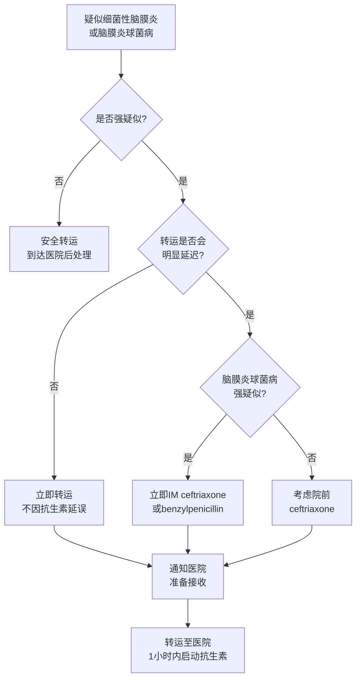

# 院前转运

## 本章目录

- [[NICE-BacM-0-概述]]
- [[NICE-BacM-1-识别诊断]]
- [[NICE-BacM-3-信息支持]]

---

## 🚑 1. 转运原则（Rec 1.2.1-1.2.3）

> [!danger] 强推荐
> 疑似细菌性脑膜炎或脑膜炎球菌病患者 → **立即作为急诊转运至医院**（Rec 1.2.1）。

| 要求 | 说明 |
|------|------|
| 提前通知 | 告知医院患者正在转运，需接收评估（Rec 1.2.2）|
| **不因抗生素延误转运** | 不得因院前给抗生素而延迟转运（Rec 1.2.3） |

> [!warning] 不要因抗生素延误转运
> 院前给抗生素仅在转运可能明显延迟时考虑，且不得以抗生素替代及时转运。

---

## 💉 2. 院前抗生素（Rec 1.2.4-1.2.6）

| 情况 | 推荐 |
|------|------|
| **强烈疑似细菌性脑膜炎** + 转运可能延迟 | 考虑院前抗生素 |
| **强烈疑似脑膜炎球菌病** | 立即静脉或肌注 **ceftriaxone** 或 **benzylpenicillin** |
| 严重抗生素过敏 | **不要**院外给予 ceftriaxone 或 benzylpenicillin |

> [!quote] 院前抗生素 Rec 1.2.4-1.2.5
> - 强烈疑似细菌性脑膜炎且转运延迟 → 考虑院前 ceftriaxone
> - 强烈疑似脑膜炎球菌病 → 尽快给予 ceftriaxone 或 benzylpenicillin

---

## 📊 3. 院前决策流程

---

## 相关条目

- [[NICE-BacM-0-概述]] — 指南概述
- [[NICE-BacM-1-识别诊断]] — Red Flag Combination 与 Red Flag Symptoms
- [[NICE-BacM-4-抗生素]] — 医院内抗生素方案