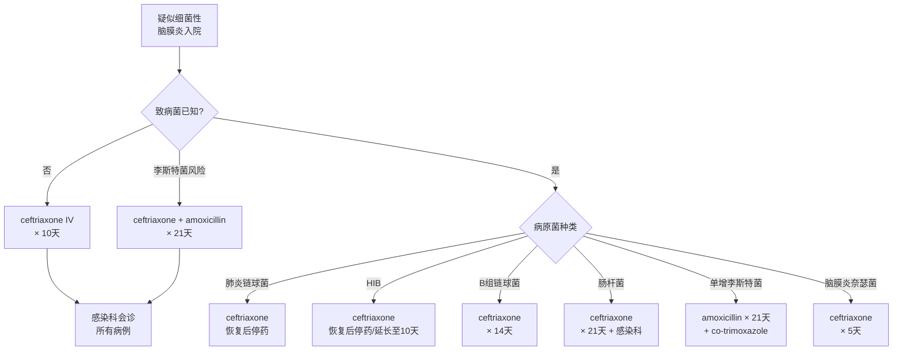

# 抗生素

> [!danger] ⚠️ 头孢曲松配伍警告（2024年3月）
> 使用 ceftriaxone 时，遵循 MHRA 安全建议：**ceftriaxone 与含钙溶液不相容**。

## 本章目录

- [[NICE-BacM-0-概述]]
- [[NICE-BacM-1-识别诊断]]
- [[NICE-BacM-5-脑球抗生素]]
- [[NICE-BacM-6-皮质激素]]

---

## 🔬 1. 一般原则

| 要求 | 说明 |
|------|------|
| 采血 | 抗生素**使用前**完成血培养等血液检查（Rec 1.6.1）|
| 腰椎穿刺 | 安全情况下，抗生素**使用前**完成（Rec 1.6.2）|
| 启动时间 | 抵达医院后 **1小时内** 静脉抗生素（Rec 1.6.3）|
| 感染科会诊 | **所有**细菌性脑膜炎病例均需会诊（Rec 1.6.4） |

> [!warning] 特殊会诊指征
> - 近期待旅行至英国以外地区（耐药风险）
> - 定植有头孢耐药肠杆菌者

---

## 🦠 2. 致病菌未知时的经验性治疗（Rec 1.6.5-1.6.9）

| 情况 | 推荐方案 |
|------|---------|
| **标准方案** | **ceftriaxone**（BNF/BNFC 最高推荐剂量）|
| ceftriaxone 禁忌 | 考虑 cefotaxime（早产儿<41周需参考BNFC）|
| **李斯特菌风险人群** | ceftriaxone 或 cefotaxime **+ 静脉 amoxicillin** |
| 不常规给予 | 阿昔洛韦（除非单纯疱疹性脑炎高度疑似）|

> [!note] 李斯特菌风险人群（Rec 1.6.6）
> 年龄 >50岁、免疫抑制、孕妇——需额外覆盖单增李斯特菌。

### 2.1 治疗持续时间

| 情况 | 处置 |
|------|------|
| CSF提示细菌性脑膜炎但血培养/PCR阴性 | 继续抗生素共 **10天**，10天后若恢复则停药，否则感染科会诊 |
| 持续未恢复（10天后）| 感染科进一步会诊 |

---

## 🧫 3. 已知致病菌时的治疗方案

### 3.1 肺炎链球菌（Rec 1.6.10）

| 项目 | 内容 |
|------|------|
| **一线** | ceftriaxone（BNF/BNFC最高剂量）|
| 替代 | cefotaxime（ceftriaxone禁忌时）|
| 疗程 | 恢复则停药；未恢复10天后感染科会诊 |

### 3.2 B型流感嗜血杆菌（Rec 1.6.11）

| 项目 | 内容 |
|------|------|
| **一线** | ceftriaxone |
| 替代 | cefotaxime（ceftriaxone禁忌时）|
| 感染科会诊 | 治疗开始时即需会诊 |
| 疗程 | 恢复则7天后停药；未恢复延长至10天，再未恢复则感染科会诊 |

### 3.3 B组链球菌（Rec 1.6.12）

| 项目 | 内容 |
|------|------|
| **一线** | ceftriaxone |
| 替代 | cefotaxime（ceftriaxone禁忌时）|
| 感染科会诊 | 治疗开始时即需会诊 |
| 疗程 | 恢复则14天后停药；未恢复则感染科会诊 |

### 3.4 肠杆菌/大肠杆菌（Rec 1.6.13）

| 项目 | 内容 |
|------|------|
| **一线** | ceftriaxone |
| 替代 | cefotaxime（ceftriaxone禁忌时）|
| 备选 | 待药敏结果期间，感染科会诊考虑 meropenem |
| 疗程 | 恢复则21天后停药；未恢复则感染科会诊 |

### 3.5 单增李斯特菌（Rec 1.6.14）

| 项目 | 内容 |
|------|------|
| **一线** | 静脉 amoxicillin 或 ampicillin **× 21天** |
| 联合 | 前7天加用静脉 co-trimoxazole（感染科会诊建议）|
| 停药 | 恢复则21天后停药；未恢复感染科会诊 |

> [!warning] 标签外用药
> co-trimoxazole 用于李斯特菌 meningitis 前7天为标签外用药（2024年3月）。

### 3.6 脑膜炎奈瑟菌（Rec 1.6.15）

| 项目 | 内容 |
|------|------|
| **一线** | ceftriaxone |
| 替代 | cefotaxime（ceftriaxone禁忌时）|
| 疗程 | 恢复则5天后停药；未恢复感染科会诊 |

---

## 💊 4. 抗生素过敏替代方案（Rec 1.6.16）

| 过敏严重程度 | 方案 |
|------------|------|
| **非严重过敏** | ceftriaxone/cefotaxime（覆盖全部致病菌）；李斯特菌风险人群加 co-trimoxazole |
| **严重过敏** | 李斯特菌风险：co-trimoxazole + chloramphenicol；其他致病菌：单用 chloramphenicol |

> [!tip] 一般原则
> 询问过敏反应类型；孕妇需感染科特别会诊。

---

## 📊 5. 抗生素方案速查

---

## 相关条目

- [[NICE-BacM-0-概述]] — 指南概述
- [[NICE-BacM-1-识别诊断]] — 识别与诊断流程
- [[NICE-BacM-5-脑球抗生素]] — 脑膜炎球菌病抗生素方案
- [[NICE-BacM-6-皮质激素]] — 皮质类固醇使用
- [[脓毒症/SCCM/SCCM-SSC-2-感染]] — 脓毒症的抗生素管理原则（脑膜炎→脓毒性休克的抗生素衔接）