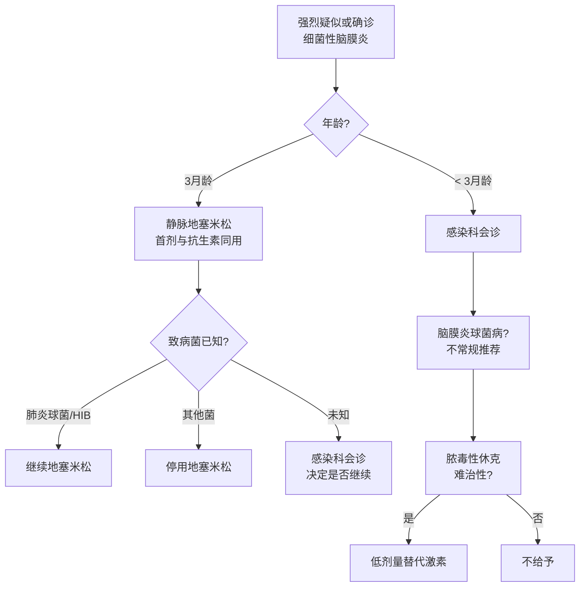

# 皮质激素

> [!warning] 标签外用药提示（2024年3月）
> 本章节所有地塞米松用法均为标签外用药，请查阅 NICE 药品处方信息。

## 本章目录

- [[NICE-BacM-0-概述]]
- [[NICE-BacM-5-脑球抗生素]]
- [[NICE-BacM-7-ICP管理]]

---

## 💊 1. 细菌性脑膜炎（Rec 1.8.1-1.8.5）

### 1.1 适用人群

| 人群 | 处置 |
|------|------|
| **> 3月龄** | 强推荐静脉地塞米松 |
| **28天-3月龄** | 感染科会诊后决定是否使用 |
| **< 28天** | 不适用（参见新生儿感染指南）|

### 1.2 已知致病菌后的决策

| 致病菌 | 地塞米松 |
|--------|---------|
| 肺炎链球菌 | **继续** |
| B型流感嗜血杆菌 | **继续** |
| 其他致病菌 | **停药** |

### 1.3 给药时机

| 条件 | 处置 |
|------|------|
| 首剂 | 与首剂抗生素**同用或之前** |
| 不应因等地塞米松延误抗生素 | — |
| 抗生素后 < 12小时延迟 | 尽快给予地塞米松 |
| 抗生素后 > 12小时延迟 | 感染科会诊评估是否仍可能获益 |

---

## 🚫 2. 脑膜炎球菌病（Rec 1.8.6-1.8.7）

> [!warning] 不推荐
> 脑膜炎球菌病**不常规给予**皮质类固醇（Rec 1.8.6）。

> [!tip] 特殊情况
> 脑膜炎球菌病脓毒性休克**对高剂量血管活性药物无反应**时，可考虑低剂量替代激素（Rec 1.8.7）。

---

## 📊 3. 皮质激素使用决策流程

---

## 相关条目

- [[NICE-BacM-0-概述]] — 指南概述
- [[NICE-BacM-4-抗生素]] — 细菌性脑膜炎抗生素方案
- [[NICE-BacM-5-脑球抗生素]] — 脑膜炎球菌病抗生素方案
- [[NICE-BacM-7-ICP管理]] — ICP管理