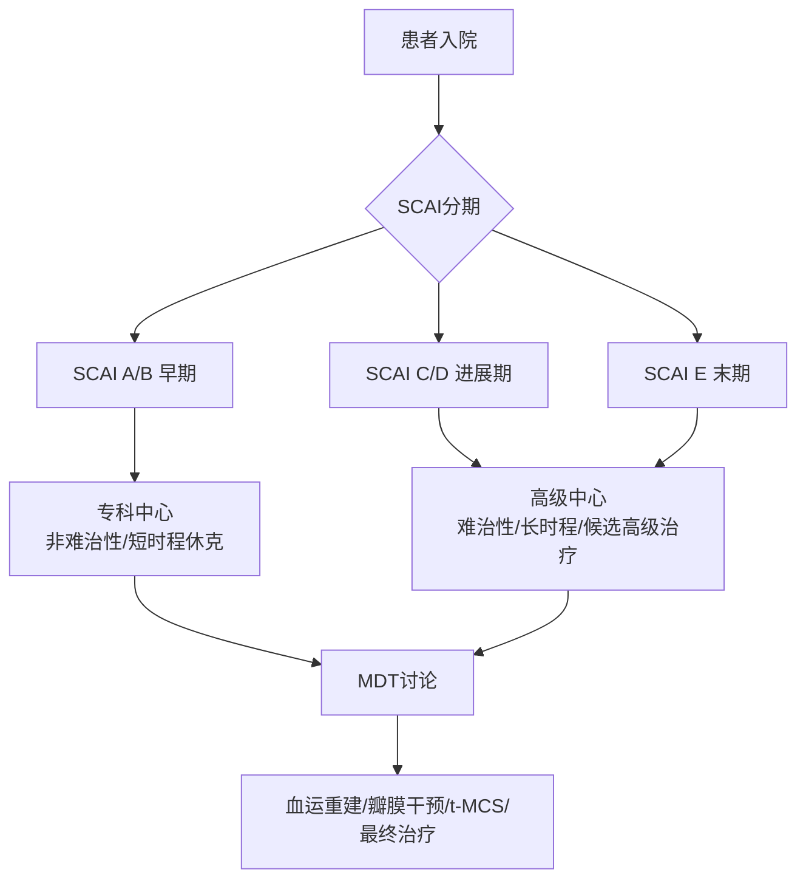

# 领域1 — 休克团队与专家中心

## 推荐条目

### R1. 多学科休克团队

**推荐强度：Grade 2+（中等推荐）**

> CS患者应由多学科休克团队（multidisciplinary CS team）管理。

**依据**：5项研究共911例患者报告，实施休克团队策略后住院生存率提高20%-34%，组内住院生存率54%-76%。多中心回顾性登记研究（1242例）显示有休克团队配置的医院住院生存率显著更高。局限性：单中心研究、前后对照设计；另两项同样设计的回顾性研究未发现住院死亡率显著差异，但报告长期生存率改善。

**团队构成建议**：
- 24/7可用
- 涵盖：CS识别与诊断专家、严重程度评估与分期专家、高级重症监护专家、及时实施循证管理策略（包括t-MCS启动）专家
- 机构内可用的专业和关键技术平台为基础

**团队结构示意**：

### R2. 区域化转诊网络

**推荐强度：专家意见**

> 通过以专科休克专家中心为中心的多学科休克团队构建结构化区域网络，讨论和管理CS患者，确保基于可用资源和专业知识的充分转诊和管理。

**依据**：无直接比较不同休克团队配置的研究。标准化诊断和CS分类方案（如SCAI分类）和基于监测/生物标志物的随访可减少决策延迟和不一致性。角色和责任明确定义可减少模糊性、防止任务分配冲突。

**关键原则**：
- 标准化诊断和分期（SCAI分类）
- 标准化监测和生物标志物随访
- 明确角色和责任分工
- 减少转运延迟

## 相关条目

- [[休克/SRLF/SRLF-心源性休克-0-概述]] — SRLF-SFC CS指南总览
- [[休克/ACC/ACC-心源性休克-6-团队激活]] — ACC CS团队激活
- [[休克/ESICM/ESICM-休克-0-概述]] — ESICM CS指南