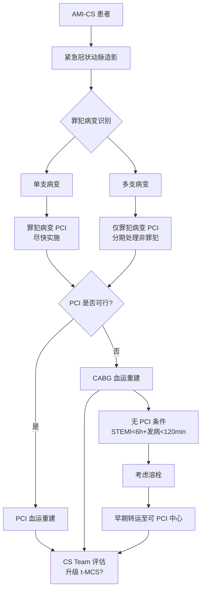

# 领域3 — 病因治疗（血运重建）

## 推荐条目

### R10A — 冠状动脉造影

**证据等级：Grade 1+（强推荐）**

> AMI-CS患者应尽早行冠状动脉造影。

### R10B — 罪犯病变血运重建（PCI）

**证据等级：Grade 1+（强推荐）**

> AMI（STEMI/NSTEMI）-CS患者，应尽快对罪犯病变进行PCI血运重建，以改善中长期生存。

!!! info "备注"
    与非CS STEMI/NSTEMI患者不同，AMI-CS无严格的时间窗限制。但若胸痛发作>12小时后再就诊，决策需经CS团队讨论。

### R10C — 仅罪犯病变PCI，延期处理非罪犯病变

**证据等级：Grade 1+（强推荐）**

> 多支病变的AMI-CS患者，首选仅在初次血管造影时对罪犯相关动脉进行PCI，延期处理非罪犯病变，以减少早期死亡率/RRT复合终点。

!!! info "备注"
    初次手术后若患者仍处于休克状态，应考虑分期血运重建，由CS团队权衡获益/风险比（濒死心肌、技术因素）。

**证据链**：

| 研究 | 关键发现 |
|------|---------|
| SHOCK试验 | 唯一显示早期血运重建（PCI 64%/CABG 36%）对比药物稳定治疗的随机研究；30天死亡率无获益，但6个月和1年生存改善；MI-随机化时间中位数12小时，25%>20小时；MI-随机化时间与获益间无统计学交互 |
| CULPRIT-SHOCK | 唯一专门评估AMI-CS非罪犯病变处理的随机试验（60% STEMI，40% NSTEMI）；仅罪犯病变PCI显著减少30天全因死亡或RRT主要复合终点；1年死亡率两组无显著差异 |
| 全国性队列研究 | 所有亚组（包括老年患者）均证实初始侵入性管理策略的获益 |

### R11A — 溶栓

**推荐强度：专家意见**

> 在无法快速获得冠状动脉血运重建（确诊后<120分钟）的STEMI患者中，且胸痛发作<6小时，可考虑限制性使用溶栓治疗。

### R11B — CABG

**证据等级：Grade 2+（中等推荐）**

> 若PCI不可行，对AMI-CS患者进行罪犯病变CABG血运重建可能改善中长期生存。

**依据**：SHOCK试验中，PCI或CABG早期血运重建的死亡率无差异，30天和1年生存率相似；观察性研究报告急诊血运重建可接受的结果。

---

## 管理流程图

---

## 关键证据解析

### SHOCK试验核心数据

| 指标 | 结果 |
|------|------|
| 30天死亡率 | 早期血运重建 vs 药物稳定：差值不显著 |
| 6个月生存 | 早期血运重建显著优于药物稳定 |
| 1年生存 | 早期血运重建显著优于药物稳定 |
| 罪犯 vs 非罪犯 | PCI与CABG结局相似 |

### CULPRIT-SHOCK核心数据

- **入选**：AMI-CS（60% STEMI，40% NSTEMI），多支病变
- **分组**：罪犯病变PCI（仅罪犯） vs 多支PCI（罪犯+非罪犯同时处理）
- **结果**：罪犯病变组30天死亡/RRT复合终点显著低于多支同时PCI组
- **1年随访**：死亡率无显著差异
- **分期策略**：罪犯组30%在30天内接受额外PCI，50-60%在6个月内接受额外PCI

---

## 相关条目

- [[休克/SRLF/SRLF-心源性休克-0-概述]] — SRLF-SFC CS指南总览
- [[急性冠脉综合征/ACC-AHA/ACC-AHA-ACS-5-STEMI再灌注]] — STEMI再灌注策略
- [[急性冠脉综合征/ACC-AHA/ACC-AHA-ACS-8-心源性休克]] — ACS-CS管理