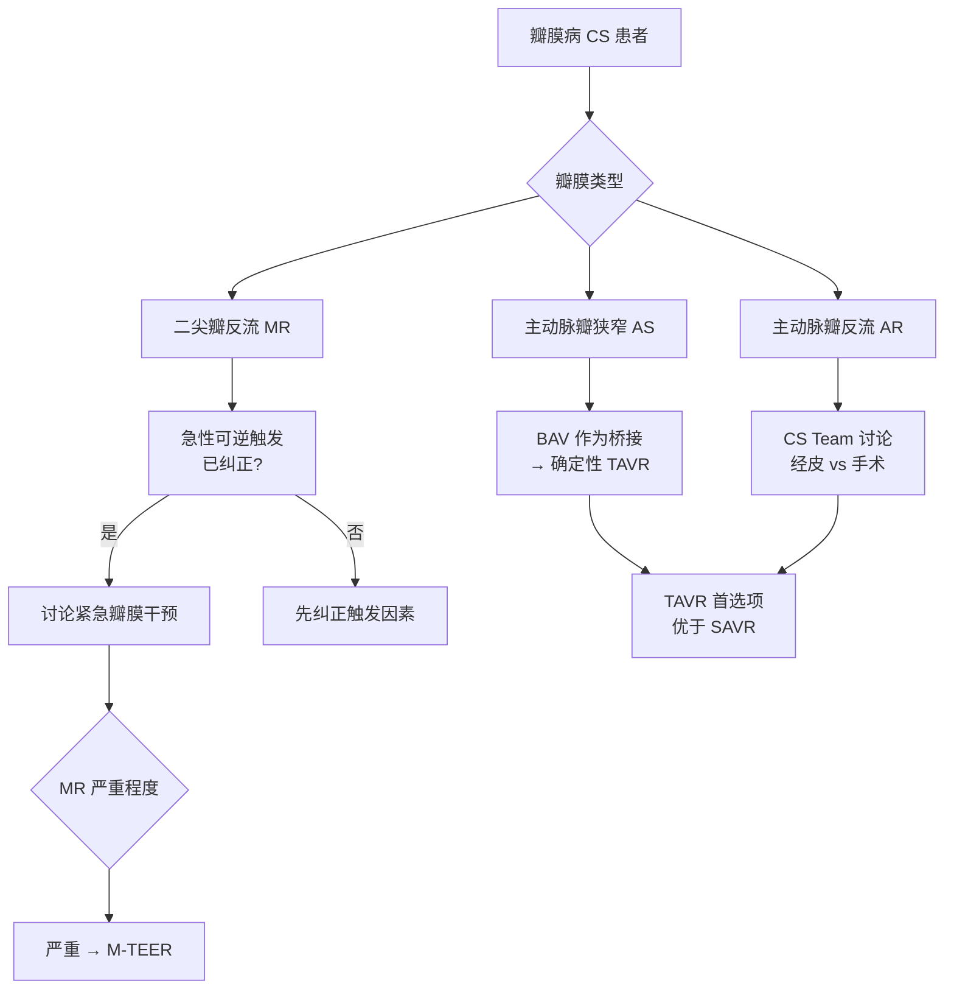

# 领域4 — 病因治疗（瓣膜病矫正）

## 推荐条目

### R12A — 主动脉瓣狭窄（AS）

**推荐强度：专家意见**

> AS相关CS患者，应激纠正后建议讨论紧急瓣膜干预。

**关键信息**：
- AS是高收入国家最常见的瓣膜病
- 不干预的AS-CS短期死亡率极高
- 干预时机至关重要
- 手术在高危患者中可行但住院死亡率高达50%

### R12B — TAVR优选

**证据等级：Grade 2+（中等推荐）**

> CS患者中，经导管主动脉瓣置换（TAVR）可能优于外科主动脉瓣置换（SAVR）作为一线选择。

**依据**：
- TAVR已成为有症状严重AS患者≥70岁、三叶式主动脉瓣的I类推荐（证据等级A）
- CS是TAVR随机临床试验的排除人群，指南对这类患者仍推荐球囊主动脉瓣膜成形术（BAV）作为向确定性（手术或经导管）策略过渡的桥梁
- BAV获益短暂，急性主动脉反流并发症并不少见
- TAVR提供更好、更持久的血流动力学改善（可能转化为更好结局）
- 急性/紧急情况下可行，尽管并发症率高于择期患者，对这一高危人群可接受
- 经皮途径应始终优先考虑，尤其是TAVR

**2025 ESC/EACTS瓣膜指南新增**：
- 纯主动脉反流不可手术/极高危患者的TAVR：Class IIb，证据等级B

### R13 — 主动脉瓣反流（AR）

**推荐强度：专家意见**

> AR相关CS患者，建议激活CS团队讨论决策（经皮 vs 手术）——时机和策略选择取决于基础病变、患者特征和当地专业能力。

### R14A/B — 二尖瓣反流（MR）

**R14A（专家意见）**：MR相关CS患者，当急性/可逆性负性触发因素已逆转后，建议讨论紧急瓣膜干预。

**R14B（专家意见）**：严重MR相关CS患者，心脏团队讨论后考虑紧急二尖瓣经导管边缘对边缘修复（M-TEER）。

**注意事项**：
- 功能性MR vs 器质性MR：文献数据不足以单独区分管理
- 严重功能性MR（无论新发或慢性）：根据合并症和一般状况，与CS团队讨论心脏移植或持久MCS
- M-TEER解剖禁忌证（如乳头肌断裂）可能排除使用该技术

**M-TEER证据**：
- 471例MI后MR患者（35%为CS），早期MR矫正与住院和1年死亡率降低相关
- 1192例CS伴二尖瓣疾病住院患者全国匹配队列分析：M-TEER治疗组住院和1年死亡率显著低于未行MR矫正组
- 3797例CS伴显著MR接受M-TEER患者：手术成功与1年死亡率或心衰入院降低相关

### R15 — 心率管理

**推荐强度：无推荐**

>  литературы无数据，本专家组无法给出关于增加CS患者心率的推荐。

**依据**：增加心率改善CS患者预后（晚期心衰或CS）仍存在争议，除完全性房室传导阻滞或窦房结功能障碍引起的缓慢性心律失常所致的休克外，无相关数据。

---

## 经导管瓣膜介入路径

---

## 相关条目

- [[休克/SRLF/SRLF-心源性休克-0-概述]] — SRLF-SFC CS指南总览
- 心脏瓣膜病综合管理（当前知识库中无对应独立章节）