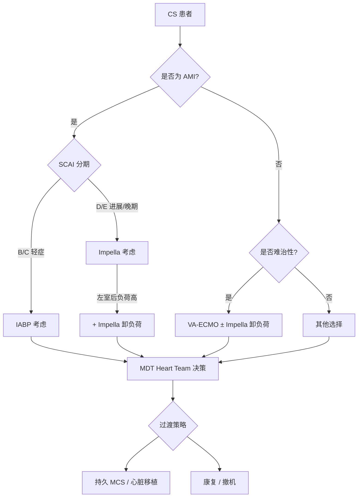

# 领域6 — 临时机械循环支持（IABP/Impella/VA-ECMO）

## t-MCS设备概览

| 设备 | 机制 | 获益 | 局限性 |
|------|------|------|--------|
| IABP | 反搏 | 降低后负荷、增加冠状动脉灌注 | 心输出量增加有限（~0.5L/min） |
| Impella | 微轴流泵 | 直接减轻左室负荷 | 血管并发症、溶血 |
| VA-ECMO | 静-动脉 ECMO | 极重度休克的完整血流动力学支持 | 左室后负荷增加、需要双侧灌注 |

---

## IABP — R18A/B/C

### R18A — 不作为常规支持

**证据等级：Grade 1−（强反对）**

> AMI-CS患者不应将IABP作为常规临时机械循环支持。

**依据**：
- IABP减少心脏后负荷和心肌氧耗，同时改善冠状动脉血流，但心输出量增加有限（约0.5L/min），削弱了其在CS中的效用
- 溶栓时代观察性数据支持IABP广泛使用
- 57例MI伴持续性低血压小规模RCT：IABP组 vs 药物治疗6个月全因死亡率无获益（34% vs 43%，P=0.23）
- IABP-SHOCK II试验（600例）：30天全因死亡率主要终点阴性（IABP 39.7% vs 对照 41.3%，P=0.69）；次要终点（住院再梗死、支架血栓、血乳酸、肾功能、ICU住院时长）相似；长期（1年、6年）结果相似

**IABP-SHOCK II试验局限性**：
- 开放标签设计，交叉不对称（对照组10%交叉使用IABP）
- 45%患者在随机化前有过复苏，37%接受了治疗性低温（血管麻痹综合征患者可能不获益）
- 未报告死因（临终关怀撤出可能占显著比例）
- 入选患者更可能处于更晚期（SCAI C/D/E）

**IABP在不严重CS（SCAI B）中的可能获益仍有待证实**。

### R18B/C

**R18B（专家意见）**：IABP可能用于特定临床场景（如右室衰竭、合并室间隔穿孔的二尖瓣反流），由CS团队评估。

**R18C（专家意见）**：IABP禁用于严重主动脉反流的CS患者。

---

## Impella — R19A/B

### R19A — 可考虑用于特定患者

**推荐强度：专家意见**

> 微轴流泵（Impella）可考虑用于选择适当的CS患者，以降低短期不良事件风险。

### R19B — 需MDT评估

**推荐强度：专家意见**

> Impella的使用应由多学科心脏团队（Heart Team）决策，权衡患者风险/获益比。

**关键证据**：
- **DanGer Shock试验**（NEJM 2024）：微轴流泵 vs 标准治疗，360例AMI-CS患者，主要复合终点（30天全因死亡、复苏的心脏骤停、启动其他MCS、卒中）的绝对差异为5个百分点（95%CI 0.5-9.5），有利于微轴流泵组；严重出血并发症更高
- 多中心研究：Impella 5.0/5.5作为心脏移植桥接，移植前生存率良好
- 外科植入Impella 5.5在心脏术后CS和晚期心衰患者中的临床结局数据

---

## VA-ECMO — R20A/B, R21

### R20A — 用于难治性CS

**推荐强度：专家意见**

> 难治性CS患者可考虑使用静脉-动脉体外膜氧合（VA-ECMO）。

**难治性CS定义**：优化治疗后仍持续低灌注。

### R20B — 需MDT决策

**推荐强度：专家意见**

> VA-ECMO的启动和管理应由多学科团队（心脏团队+CS团队+ECMO专家）决策，平衡血流动力学支持需求与左室后负荷增加风险。

### R21 — LV卸负荷

**推荐强度：专家意见**

> VA-ECMO患者可能需要同时进行左室卸负荷，以避免肺水肿恶化。

**卸负荷策略**：
- Impella（最适合）
- 球囊主动脉瓣膜成形术（BAV）
- 房间隔造口
- 其他经皮/手术方法

---

## t-MCS选择流程

---

## 相关条目

- [[休克/SRLF/SRLF-心源性休克-0-概述]] — SRLF-SFC CS指南总览
- [[休克/ACC/ACC-心源性休克-9-临时机械循环支持]] — ACC t-MCS章节
- [[心脏骤停/ERC ESICM/ERC ESICM-PostCA-0-概述]] — 成人心脏骤停（ECMO+cannulation相关）