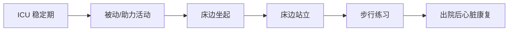

# 领域7 — 撤机与早期康复

## 推荐条目

### R22 — t-MCS撤机

**推荐强度：专家意见**

> 建议制定针对CS患者临时机械循环支持（t-MCS）撤机的标准化方案。

**撤机要点**：
- 血流动力学稳定（MAP>65 mmHg、无终末器官低灌注迹象）
- 正性肌力药剂量逐渐减低
- 评估心脏功能恢复（超声/血流动力学监测）
- 避免突然撤除高支持设备
- 呼吸机撤机遵循ICU标准流程

### R23 — 早期活动和康复

**推荐强度：专家意见**

> 建议在CS存活患者中早期启动活动（mobillisation）和多学科康复。

**循证依据**：
- **STRONG-HF试验**：急性心衰住院患者出院后早期递增GDMT（指南-directed medical therapy）vs 常规治疗，90天全因死亡或心衰再入院显著减少（安全性良好，血压和肾功能监测下耐受性可接受）
- **6个月活动评估**：危重患者6个月时活动水平的meta分析显示，早期活动干预与功能改善相关
- **TEAM试验**（NEJM 2022）：早期活动性机械通气ICU患者，90天时存活+出院时间、无机械通气天数、无谵妄天数、ICU后存活无严重残疾天数等结局均显著改善
- **ICU患者活动安全性和可行性系统综述**：主动活动干预与不良事件和死亡率增加无关

**特殊人群活动**：
- IABP患者：股动脉IABP支持下卧床患者活动（桥接心脏移植）安全可行
- ECMO患者：早期活动安全性已在前瞻性观察研究和随机 pilot 试验中证实

---

## CS患者康复阶梯

**GDMT递增策略（STRONG-HF方案）**：
- 出院前评估血压、肾功能和心衰体征
- 2周内递增至目标剂量（β受体阻滞剂、ACEi/ARB/ARNI、MRA、SGLT2i）
- 6周随访：临床评估、实验室检查、剂量调整

---

## 相关条目

- [[休克/SRLF/SRLF-心源性休克-0-概述]] — SRLF-SFC CS指南总览
- [[休克/ACC/ACC-心源性休克-10-重症监护]] — ACC 重症监护章节
- [[ICU PADIS/SCCM/SCCM-ICU PADIS-0-概述]] — PADIS镇痛镇静谵妄指南