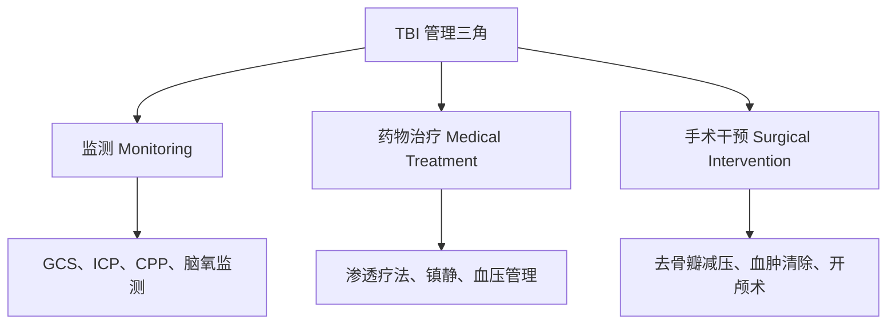

# 结果-管理策略

## 3.3 Management 概述

### 多学科团队构成

TBI 管理需要 **多学科团队** 紧密协作：

> [!tip]- 核心团队成员
> - **神经外科**：手术指征判断、去骨瓣减压
> - **神经内科**：监测方案、长期随访
> - **创伤外科**：多发伤协调
> - **重症医学（ICU）**：ICP管理、生命支持
> - **康复科**：认知/运动功能恢复

### 管理三角

### 管理目标

> [!abstract] 三大核心目标
> 1. **稳定患者**（Stabilize the patient）
> 2. **减轻继发性损伤**（Mitigate secondary injury）
> 3. **优化神经功能恢复**（Optimize neurological recovery）

### 循证基础

| 指南/文献 | 年份 | 推荐数 | 核心更新 |
|-----------|------|--------|---------|
| **BTF 第4版指南** | 2020 | 28条 | 去骨瓣减压时机修正 |
| **RESCUEicp** | 2016 | — | 晚期难治性ICP去骨瓣降低死亡率 |
| **DECRA** | 2011 | — | 早期去骨瓣不改善功能预后 |

### Living Guidelines 机制

> [!note] Congress of Neurological Surgeons
> 已采用"**活指南**"（Living Guidelines）模式：
> - 新证据实时整合，无需等待全本修订
> - 2023年 RESCUE-ASDH 结果已快速纳入
> - 保证指南始终反映最新循证依据

### 特殊人群考量

> [!warning] 老年患者管理
> CENTER-TBI（2015）数据显示：
> - ICU 中 TBI 患者中位年龄为 **49 岁**（较历史数据显著上升）
> - **20%** 的 ICU 患者年龄 >65 岁
> - 老年患者可能无法耐受与年轻患者同等强度的积极治疗
> → 指南建议针对不同年龄段调整管理策略

### 患者与家庭

> [!important] 家庭支持的重要性
> 严重 DAI 患者恢复期可长达**数月至数年**：
> - 广泛的神经功能缺陷和精神状态改变常见
> - 家庭支持必须纳入管理计划
> - 对儿科TBI患者影响尤为突出

---

## 相关条目

[[创伤性脑损伤/JOCM/JOCM-TBI-2-结果-病理生理]] | [[创伤性脑损伤/JOCM/JOCM-TBI-4-院前与急性处置]]

