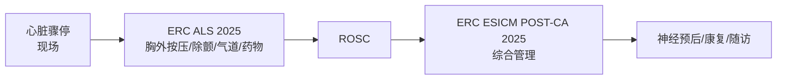

# ERC ESICM POST-CA 2025 成人心脏骤停后综合管理指南

> [!abstract] ERC ESICM 联合指南系列
> 本指南与 [[ERC-ALS-0-概述]]（成人高级生命支持）配套，前者覆盖现场急救，**本指南覆盖 ROSC 后综合管理**。

---

## 本章目录

- [[ERC ESICM-PostCA-1-即刻处理与病因诊断]]
- [[ERC ESICM-PostCA-2-气道与呼吸支持]]
- [[ERC ESICM-PostCA-3-循环与冠状动脉再灌注]]
- [[ERC ESICM-PostCA-4-血流动力学与心律失常]]
- [[ERC ESICM-PostCA-5-神经保护与癫痫控制]]
- [[ERC ESICM-PostCA-6-体温控制]]
- [[ERC ESICM-PostCA-7-ICU一般管理]]
- [[ERC ESICM-PostCA-8-神经预后预测]]
- [[ERC ESICM-PostCA-9-康复与随访]]
- [[ERC ESICM-PostCA-10-不明原因CA与心脏骤停中心]]
- [[ERC ESICM-PostCA-11-证据支撑]]

---

## 📋 指南元数据

| 项目 | 内容 |
|------|------|
| **指南全称** | European Resuscitation Council and European Society of Intensive Care Medicine Guidelines 2025 on Post-Resuscitation Care |
| **发表期刊** | *Resuscitation* + *Intensive Care Medicine* |
| **发布时间** | 2025年6月12日 |
| **发布机构** | 🏥 **ERC**（欧洲复苏委员会）+ **ESICM**（欧洲危重症医学学会）|
| **doi** | 10.1016/j.resuscitation.2025.110XXX |
| **版本** | 第三版（2015年 → 2021年 → **2025年**） |
| **方法学** | GRADE · COR/LOE 分级系统 |
| **公开征询** | 2025年5月5日-30日（61人提交69条意见，10处修改）|

---

## 🗂️ 指南与 ERC ALS 的定位

| 指南 | 覆盖层面 | 核心内容 |
|------|---------|---------|
| **ERC ALS 2025** | 现场 / 急救 | 胸外按压、除颤、气道、药物、围骤停心律失常 |
| **ERC ESICM POST-CA 2025** | ROSC 后院内 | 氧合/通气、循环、神经保护、预后、康复、器官捐献 |

---

## 📖 Abstract

> [!quote]
> The European Resuscitation Council (ERC) and the European Society of Intensive Care Medicine (ESICM) have collaborated to produce these post-resuscitation care guidelines for adults, which are based on the International Consensus on Cardiopulmonary Resuscitation Science with Treatment Recommendations (CoSTR) published by the International Liaison Committee on Resuscitation (ILCOR).
>
> **Topics covered**：post-cardiac arrest syndrome, diagnosis of cause of cardiac arrest, control of oxygenation and ventilation, coronary reperfusion, haemodynamic monitoring and management, control of seizures, temperature control, general intensive care management, prognostication, long-term outcome, rehabilitation, and organ donation.
>
> **Keywords**：Post-cardiac arrest syndrome · Cardiac arrest · Acute coronary syndrome · Coma · Temperature · Prognosis · Rehabilitation · Tissue and organ procurement

---

## 🔑 2021 vs 2025 主要变化汇总

| 主题 | 2021 | **2025** |
|------|------|---------|
| 病因诊断 | STE 优先冠脉造影；CT 备选 | 无 STE 优先**全身 CT（含肺动脉 CTA）** |
| 氧合 | SpO₂ 94-98% | 同；**增加深肤色指氧误差警示** |
| 通气 | PaCO₂ 4.7-6.0 kPa | 同；低温患者**注意低碳酸血症** |
| 冠脉策略 | 无 STE 可考虑立即导管室 | **建议延迟**（除非高度提示冠脉闭塞）|
| 血流动力学 | MAP > 65 mmHg | **MAP > 60-65 mmHg** |
| 心律失常 | 未详细涉及 | **新增章节** |
| 癫痫管理 | 推荐 EEG 监测 | **肌阵挛+良性EEG应尝试唤醒试验** |
| ⚠️ **体温管理** | TTM 32-36°C ≥24h；>37.7°C 避免 ≥72h | **≤37.5°C ≥72h 防发热；术语更新为"体温控制"** |
| ICU管理 | 应激性溃疡 + VTE 预防 | 维持；强调**短效镇静**；**不常规推荐 NMBA** |
| 神经预后 | ≥72h 多模态评估 | 维持；**脑 CT/SSEP 时机纳入流程图** |
| 康复 | 出院前功能评估 + 3个月内随访 | 增加**ICU 内早期康复/谵妄管理/ICU日记**；**强调共照护者** |
| 器官捐献 | 考虑器官捐献 | 增加**心脏骤停登记应报告器官捐献** |
| 不明原因CA | 未纳入 | **新增章节**（基因检测/心脏MRI/钠通道阻滞剂试验）|

---

## 🌡️ 体温管理——2025 最大变化

> [!danger] 核心更新
> **术语变更**：`TTM（Targeted Temperature Management）` → `Temperature Control（体温控制）`

| 对比项 | 2021 | **2025** |
|------|------|---------|
| 目标 | 32-36°C ≥ 24h | **≤ 37.5°C ≥ 72h** |
| 策略 | 主动降温至目标区间 | **主动防发热** |
| 低温患者 | 控温至 32-36°C | **不主动复温** |
| 院前冷液 | 可考虑 | **强反对** |
| 核心逻辑 | "越低越好" | **"控制体温，避免发热"** |

详见 [[ERC ESICM-PostCA-6-体温控制]]。

---

## 📊 指南文件结构

| 文件 | 主题 | 核心关键词 |
|------|------|---------|
| PostCA-1 | 即刻处理与病因诊断 | ROSC 原则、冠脉造影、全CT |
| PostCA-2 | 气道与呼吸支持 | SpO₂ 94-98%、PaCO₂ 4.7-6.0 kPa |
| PostCA-3 | 循环与冠脉再灌注 | STEMI PCI、无STE延迟评估 |
| PostCA-4 | 血流动力学与心律失常 | MAP >60-65 mmHg、MCS |
| PostCA-5 | 神经保护与癫痫控制 | EEG、左乙拉西坦、唤醒试验 |
| PostCA-6 | **体温控制** | **≤37.5°C ≥72h** |
| PostCA-7 | ICU一般管理 | 短效镇静、营养、应激性溃疡 |
| PostCA-8 | 神经预后预测 | 多模态、72h节点、WLST |
| PostCA-9 | 康复与随访 | 早期康复、3个月随访、共照护者 |
| PostCA-10 | 不明原因CA与心脏骤停中心 | 基因检测、心脏骤停中心 |
| PostCA-11 | 证据支撑 | Part 2全文、参考文献 ~1100条 |

---

## 相关条目

- [[慢性阻塞性肺病/GOLD/GOLD-COPD-4-急性加重管理]] — COPD急性加重可导致心脏骤停/急性呼衰
- [[慢性阻塞性肺病/GOLD/GOLD-COPD-5-合并症]] — COPD合并CVD是CA重要危险因素

- [[ERC-ALS-0-概述]] — ERC 2025 成人高级生命支持（现场急救层面）
- [[ERC ESICM-PostCA-6-体温控制]] — 体温控制（核心变化章节）
- [[热射病/SCCM/SCCM-热射病-3-降温推荐]] — 热射病快速降温（冰/冷水浸没，≤30min达目标温度）与心脏骤停后体温控制（≤37.5°C ≥72h）共享降温速率和神经保护机制
- [[ERC ESICM-PostCA-8-神经预后预测]] — 神经预后预测
- [[ERC ESICM-PostCA-11-证据支撑]] — 全部章节证据支撑
- [[神经重症镇痛镇静/NCHN/NCHN-神经重症镇痛镇静-5-TTM应用]] — NCHN共识Rec 29-31：神经重症TTM适应证（心搏骤停后/sTBI/SAH/大面积脑梗死/癫痫持续状态），共享TTM适应证框架