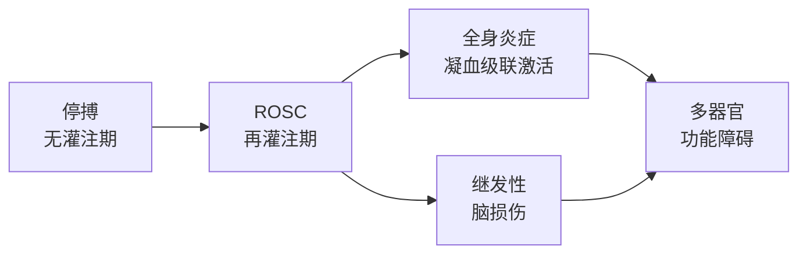
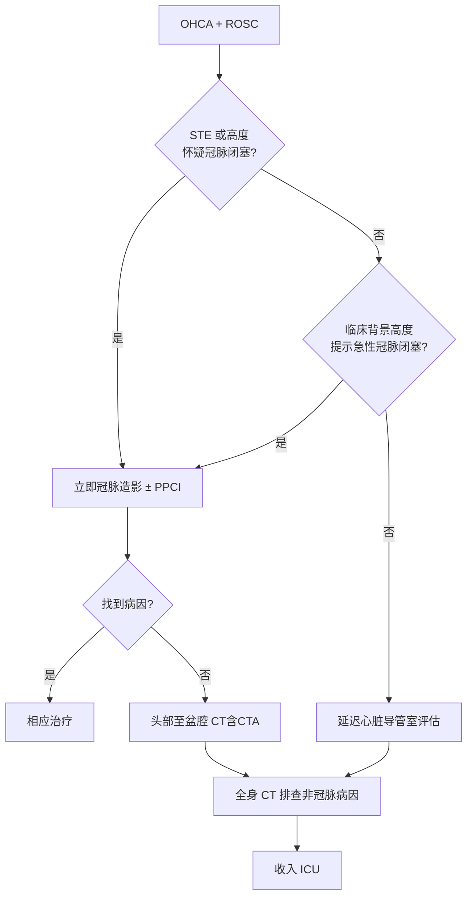

# 即刻处理与病因诊断

## 本章目录

- [[ERC ESICM-PostCA-0-概述]] — 返回指南概述
- [[ERC ESICM-PostCA-2-气道与呼吸支持]]
- [[ERC ESICM-PostCA-3-循环与冠状动脉再灌注]]

---

## 🫀 1. ROSC 即刻处理原则

> [!important] 核心推荐
> 心脏骤停后自主循环恢复（ROSC）后，**无论身处何地**，均应立即开始后复苏综合治疗。

### 后复苏综合征病理生理

**四阶段损伤机制**：

| 阶段 | 核心机制 | 临床后果 |
|------|---------|---------|
| 🔴 无灌注期 | ATP 耗竭 → Na⁺/K⁺ 泵失效 → 钙超载 | 神经元不可逆损伤 |
| 🟡 再灌注期 | 谷氨酸释放 → 钙超载 → 蛋白酶激活 | 细胞能量衰竭 |
| 🟠 全身炎症 | 细胞因子风暴 → 凝血障碍 | 多器官功能障碍 |
| 🔵 继发性脑损伤 | 低血压/低氧/高热/癫痫 | 二次脑损伤加重 |

> [!tip] 临床提示
> 损伤严重程度与 ==停搏时间==（no-flow）和 ==CPR 持续时间==（low-flow）直接相关。

---

## 🔬 2. 病因诊断流程

### 2.1 ST 段抬高（STE）— 强推荐立即 PCI

> [!warning] 强推荐
> **ST 段抬高**，或**高度怀疑冠状动脉闭塞**（如血流动力学/电活动不稳定）→ **立即冠脉造影 ± PPCI**。

### 2.2 无 ST 抬高 — 2025 新：建议延迟评估

> [!quote] 2025 指南更新
> 无 ST 抬高的 OHCA 患者，**建议延迟心脏导管室评估**，除非临床背景高度提示急性冠脉闭塞。

| 对比 | 2021 | **2025** |
|------|------|---------|
| 无 STE + 高可能性冠脉闭塞 | 强烈考虑立即 | 可考虑立即 |
| 无 STE + 无明确冠脉闭塞证据 | 未明确 | **建议延迟** |

### 2.3 冠脉造影未找到病因

> [!note] 推荐
> 冠状动脉造影未明确病因 → 行**头部至盆腔 CT 扫描（含 CTA）**。

### 2.4 非冠状动脉病因的报警症状

> [!example] 临床场景识别
> 根据 **arrest 前驱症状** 分流影像检查：

| 前驱症状 | 提示病因 | 首选影像 |
|---------|---------|---------|
| 🤕 头痛/抽搐/神经功能缺陷 | 颅内出血/卒中 | 头部 CT |
| 😮‍💨 呼吸困难/低氧血症 | 肺栓塞/重症肺炎 | CTPA |
| 🤢 腹痛 | 主动脉夹层 | 腹部 CT + CTA |
| 🤒 发热 + 感染史 | 脓毒症 | 全身 CT + 感染筛查 |

---

## 📋 3. 诊断流程图（Fig.2）

> [!abstract] 缩写说明
> PCI = 经皮冠状动脉介入 · PPCI = 直接经皮冠状动脉介入 · ICU = 重症监护病房 · EEG = 脑电图 · ICD = 植入式心律转复除颤器

---

## 相关条目

- [[ERC ESICM-PostCA-0-概述]] — 指南元数据与 2021 vs 2025 变化
- [[ERC ESICM-PostCA-2-气道与呼吸支持]] — 气道管理与呼吸支持
- [[ERC ESICM-PostCA-3-循环与冠状动脉再灌注]] — 冠脉造影与 PCI 适应证
- [[ERC-ALS-0-概述]] — ERC 成人高级生命支持（现场急救层面）

**跨指南**
- [[上消化道出血/ACG/ACG-UGIB-3-内镜时机]]（急性消化道出血的处理优先级）