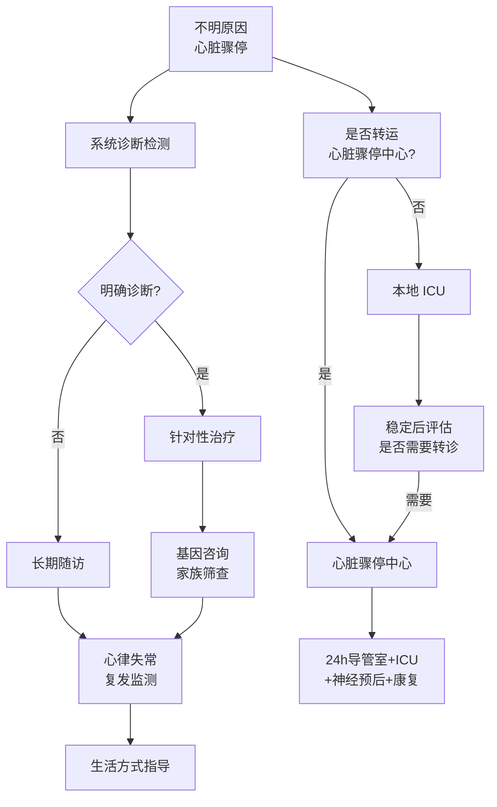

# 不明原因心脏骤停与心脏骤停中心

## 本章目录

- [[ERC ESICM-PostCA-0-概述]]
- [[ERC ESICM-PostCA-9-康复与随访]]
- [[ERC ESICM-PostCA-11-证据支撑]]

---

## 🔬 1. 不明原因心脏骤停的系统诊断

> [!warning] 2025 新增章节
> 不明原因心脏骤停（Unexplained Cardiac Arrest）需要全面系统的诊断评估，以明确病因并指导长期治疗策略。

### 诊断检测清单

> [!quote] 2025 推荐
> 不明原因心脏骤停的诊断检测包括以下项目：

| 检测类别 | 具体项目 | 目的 |
|---------|---------|------|
| 🔬 血液检测 | 毒理学、**基因检测** | 识别中毒、遗传性疾病 |
| 📱 设备数据 | CIED（植入式电子设备）数据、可穿戴设备 | 提取心律失常事件记录 |
| 💓 ECG | 反复12导联 ECG + 连续心电监测 | 识别心律失常类型 |
| 🫀 心脏 MRI | 心肌病变评估 | 识别心肌病、炎症 |
| 💊 钠通道阻滞剂试验 | 氟卡尼试验 | 排查 Brugada/长 QT 综合征 |
| 🏃 运动试验 | 运动心电图 | 运动相关心律失常评估 |

> [!tip] 基因检测
> 确诊遗传性疾病（如长 QT 综合征、Brugada 综合征、致心律失常性心肌病）后，**应进行针对性家族基因筛查**。

---

## ⚠️ 2. 长期随访

> [!important] 2025 新增
> 不明原因心脏骤停患者需要 ==**长期随访**==，因为心律失常复发风险高。

| 随访要素 | 说明 |
|---------|------|
| 心律失常复发监测 | 植入式心电记录仪（ILR）或 ICD |
| 遗传咨询 | 家族筛查 |
| 生活方式指导 | 避免触发因素 |

---

## 🏥 3. 心脏骤停中心

> [!important] 核心推荐
> 非创伤性 OHCA 患者，**应考虑转运至心脏骤停中心**进行后复苏治疗（根据当地协议尽可能实施）。

### 心脏骤停中心核心要素

| 核心要素 | 具体内容 |
|---------|---------|
| 🫀 24h 导管室 | 急诊 PCI 能力 |
| 🏥 ICU | 神经监测，呼吸机、血流动力学支持 |
| 🧠 神经预后评估 | EEG、SSEP、神经影像 |
| 📊 心脏骤停登记 | 数据收集与质量改进 |
| 🏃 康复衔接 | 早期康复、多学科随访 |

> [!note] 网络协作
> 医疗机构网络应建立当地协议，发展和维持心脏骤停网络。

---

## 📋 4. 不明原因CA与心脏骤停中心速查

---

## 相关条目

- [[ERC ESICM-PostCA-0-概述]] — 2021 vs 2025 新增不明原因CA章节
- [[ERC ESICM-PostCA-1-即刻处理与病因诊断]] — ROSC 后即刻评估流程
- [[ERC ESICM-PostCA-11-证据支撑]] — 证据支撑