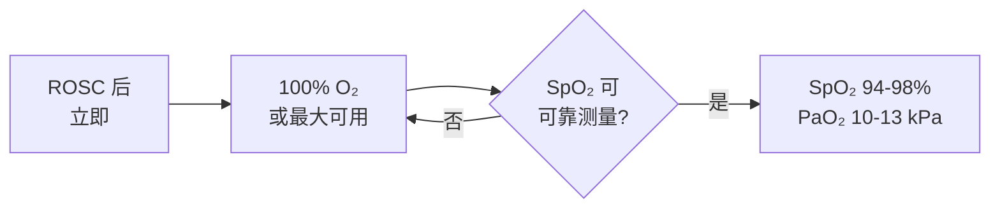
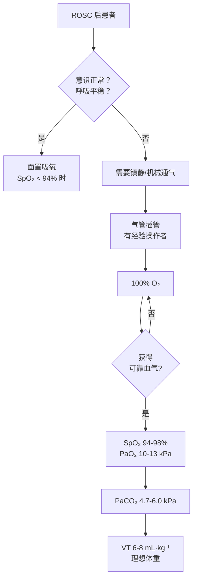

# 气道与呼吸支持

## 本章目录

- [[ERC ESICM-PostCA-0-概述]]
- [[ERC ESICM-PostCA-1-即刻处理与病因诊断]]
- [[ERC ESICM-PostCA-3-循环与冠状动脉再灌注]]

---

## 🫁 1. 气道管理

### 三类患者的气道策略

> [!tip] 分类处置原则
> 根据 ROSC 后意识状态和呼吸情况，处置分层如下：

| 患者类型 | 气道策略 | 说明 |
|---------|---------|------|
| 意识正常 + 呼吸平稳 | 面罩吸氧 | SpO₂ < 94% 时启动 |
| 昏迷或需要镇静/机械通气 | **气管插管** | 未插管者立即插管 |
| 无经验操作者可用时 | SGA 或基础气道 | 过渡到熟练团队到场 |

> [!warning] 操作者要求
> 气管插管（含药物辅助或不辅助）**只应由成功率高、经验丰富的操作者进行**。

> [!important] 必须确认
> 气管插管后**必须用波形呼气末二氧化碳（waveform capnography）确认**管端位置。

---

## 💨 2. 氧合控制

### 2.1 氧合目标

**推荐等级速查**：

| 目标 | 推荐等级 | 说明 |
|------|---------|------|
| 避免低氧血症 PaO₂ < 8 kPa / 60 mmHg | 🟢 **强推荐** | 危害明确 |
| SpO₂ 达 94-98% PaO₂ 10-13 kPa | 🟡 推荐 | 目标范围 |
| 避免高氧血症 | 🔴 **弱推荐** | 证据等级较低 |

> [!warning] 深肤色指氧误差
> ⚠️ 深肤色人群的指氧仪可能**高估**真实氧合；低血流状态信号质量差。

---

## 🌬️ 3. 通气控制

### 3.1 核心目标

| 参数 | 目标值 | 推荐等级 |
|------|--------|---------|
| **PaCO₂** | 4.7-6.0 kPa （35-45 mmHg） | 🟢 强推荐 |
| **潮气量** | 6-8 mL·kg⁻¹ 理想体重 | 🟢 强推荐 |
| **EtCO₂** | 监测 | 🟡 推荐 |

> [!note] 正常碳酸血症
> 目标 ==PaCO₂ 4.7-6.0 kPa==（normocapnia），避免低碳酸血症或高碳酸血症。

### 3.2 低温患者特殊注意事项

> [!faq]- 低温患者的血气分析
> **频繁监测 PaCO₂**——低温患者容易出现低碳酸血症。
> 
> **温度校正原则**：始终一致使用温度校正或非温度校正值，==不可在同一患者上混用==两种方式。

---

## 🏁 4. 呼吸支持流程速查

---

## 相关条目

- [[ERC ESICM-PostCA-0-概述]] — 指南元数据
- [[ERC ESICM-PostCA-1-即刻处理与病因诊断]] — 即刻处理流程
- [[ERC ESICM-PostCA-3-循环与冠状动脉再灌注]] — 循环管理
- [[ERC ESICM-PostCA-6-体温控制]] — 低温对通气的影响