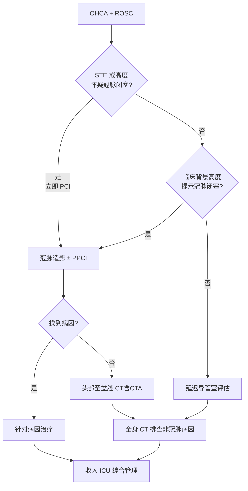

# 循环与冠状动脉再灌注

## 本章目录

- [[ERC ESICM-PostCA-0-概述]]
- [[ERC ESICM-PostCA-1-即刻处理与病因诊断]]
- [[ERC ESICM-PostCA-4-血流动力学与心律失常]]

---

## ❤️ 1. STEMI — 强推荐立即 PCI

> [!danger] 强推荐（COR 1, LOE B-R）
> 疑似心脏起源的 OHCA 伴 ==持续 ST 段抬高== → **立即送心脏导管室 ± PPCI**。

**适应证判断**：

| ECG 表现 | 合并情况 | 决策 |
|---------|---------|------|
| 明确 ST 段抬高 | 任意 | → 立即 PCI |
| ST 压低/无 STE | 血流动力学不稳定 | → 立即 PCI |
| 无 STE | 无明确冠脉闭塞证据 | → **延迟评估** |

---

## ⚠️ 2. 无 STE 的 OHCA — 2025 核心更新

> [!quote] 2025 指南更新要点
> 无 ST 抬高的 OHCA 患者，**建议延迟心脏导管室评估**，除非临床背景高度提示急性冠状动脉闭塞。

### 2021 vs 2025 变化对比

| 临床场景 | 2021 | 2025 |
|---------|------|------|
| 无 STE + 高可能性冠脉闭塞 | 强烈考虑立即 | 可考虑立即 |
| 无 STE + 无明确冠脉闭塞证据 | 未明确 | **建议延迟** |

> [!tip] 临床判断标准
> "高度提示急性冠脉闭塞"的指征：既往心肌梗死病史、持续胸痛、血流动力学崩溃等。

---

## 🩺 3. 冠脉造影后的 CT 补扫

> [!note] 推荐
> 冠状动脉造影**未找到病因**的患者，行 ==头部至盆腔 CT 扫描（含 CT 肺动脉造影）==。

详细流程见 [[ERC ESICM-PostCA-1-即刻处理与病因诊断]]。

---

## 📊 4. ROSC 后冠脉评估全流程（Fig.2）

> [!abstract] 缩写说明
> PCI = 经皮冠状动脉介入 · PPCI = 直接经皮冠状动脉介入 · ICU = 重症监护病房 · EEG = 脑电图 · ICD = 植入式心律转复除颤器 · CTA = CT 血管造影

---

## 相关条目

- [[ERC ESICM-PostCA-0-概述]] — 2021 vs 2025 变化（冠脉策略）
- [[ERC ESICM-PostCA-1-即刻处理与病因诊断]] — 病因诊断全流程（含 CT 流程）
- [[ERC ESICM-PostCA-4-血流动力学与心律失常]] — 后续血流动力学管理
- [[ACC-AHA-ACS-0-概述]] — 急性冠脉综合征（STEMI 部分衔接）