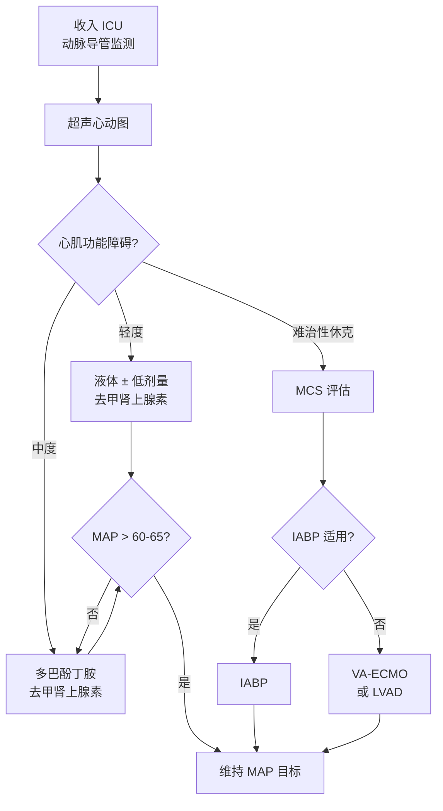

# 血流动力学与心律失常

## 本章目录

- [[ERC ESICM-PostCA-0-概述]]
- [[ERC ESICM-PostCA-3-循环与冠状动脉再灌注]]
- [[ERC ESICM-PostCA-5-神经保护与癫痫控制]]

---

## 💓 1. 血流动力学监测

| 监测项目 | 推荐 | 说明 |
|---------|------|------|
| 动脉导管 | 🟢 强推荐 | 所有患者，持续血压监测 |
| 超声心动图 | 🟢 强推荐 | 尽快进行，评估心脏病理及心肌功能 |
| 心输出量监测 | 🟡 推荐 | 仅用于血流动力学不稳定患者 |

> [!note] 推荐
> 所有患者尽快行**超声心动图**，明确基础心脏病理及定量心肌功能障碍程度。

---

## 🩺 2. 血压目标（2025 更新）

> [!warning] 核心目标
> 避免低血压，靶向 ==MAP > 60-65 mmHg==（2021版为 > 65 mmHg，2025年更新下限）。

### 维持灌注策略

| 手段 | 适应情况 |
|------|---------|
| 💧 液体 | 容量不足 |
| 🧪 去甲肾上腺素 | 血管舒张（低 SVR）|
| 💉 多巴酚丁胺 | 心肌收缩力下降（低 CO）|

> [!tip] 药物使用原则
> 根据患者个体需求选择：容量补充 → 升压 → 正性肌力，按阶梯递进。

### 代谢管理

| 项目 | 推荐 |
|------|------|
| 激素 | 🔴 **不常规使用** |
| 低钾/高钾血症 | ⚠️ 避免（与室性心律失常相关）|

---

## ⚡ 3. 机械循环支持（MCS）

> [!faq]- MCS 适应证
> **强推荐**：特定人群（如 GCS≤8、STEMI 且心脏骤停 <10 分钟，合并难治性心源性休克），在液体复苏、正性肌力药和血管活性药物**无效**时：
>
> - 首选：**IABP**（主动脉内球囊反搏）
> - 次选：**LVAD**（左室辅助装置）或 **VA-ECMO**（静-动脉体外膜氧合）
>
> 合并 **ACS** 或优化治疗后仍**反复室速/室颤**的血流动力学不稳定患者，亦应考虑 LVAD 或 VA-ECMO。

---

## ❤️ 4. ROSC 后心律失常

### 处置三原则

| 情况 | 处置 |
|------|------|
| ROSC 即刻心律失常 | 参考 **ERC 2025 ALS** 围骤停心律失常章节 |
| ROSC 后心律失常 | 治疗**潜在病因**（冠脉闭塞？电解质紊乱？）|
| 无心律失常 | **不常规预防性使用**抗心律失常药物 |

> [!warning] 不推荐
> 无心律失常的 ROSC 患者，**不常规预防性使用**抗心律失常药物。

---

## 📊 5. 血流动力学管理速查

---

## 相关条目

- [[ERC ESICM-PostCA-0-概述]] — 2021 vs 2025 血流动力学目标变化
- [[ERC ESICM-PostCA-3-循环与冠状动脉再灌注]] — 冠脉再灌注
- [[ERC ESICM-PostCA-5-神经保护与癫痫控制]] — 神经保护
- [[ERC-ALS-11-围骤停心律失常]] — ALS 围骤停心律失常处理