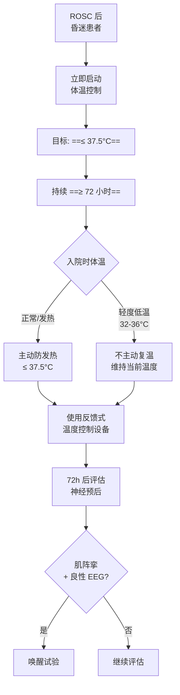

# 体温控制

> [!danger] ⚠️ 本章节为 2025 指南最大变化章节
> 术语、目标、策略全面更新，与 2021 版有根本性差异。

## 本章目录

- [[ERC ESICM-PostCA-0-概述]] — 2021 vs 2025 体温管理变化汇总
- [[ERC ESICM-PostCA-5-神经保护与癫痫控制]]
- [[ERC ESICM-PostCA-8-神经预后预测]]

---

## 🔥 1. 2025 核心推荐：主动防发热

> [!quote] 2025 核心推荐
> 对 ROSC 后仍**昏迷**的患者，**主动预防发热，目标温度 ≤ 37.5°C**，持续 **≥ 72 小时**。

---

## 📊 2. 2021 vs 2025 全面对比

| 项目 | 2021 | **2025** |
|------|------|---------|
| **术语** | TTM（Targeted Temperature Management）| **Temperature Control（体温控制）** |
| **目标温度** | 32-36°C，持续 ≥24h | **≤ 37.5°C**，持续 **≥ 72h** |
| **发热管理** | >37.7°C 避免 ≥72h | **≤ 37.5°C 主动防控**（更严格）|
| **亚低温（32-36°C）** | 常规推荐 | **不主动复温**（也不常规推荐亚低温）|
| **院前冷液快速降温** | 可考虑 | **强反对**（不常规推荐）|
| **复温策略** | 严格控制复温速率 | **已轻度低温者不主动复温** |

---

## ⚠️ 3. 四项核心推荐详解

### 3.1 主动防发热（核心）

> [!important] 强推荐
> **≤ 37.5°C**，**≥ 72 小时**

### 3.2 不主动复温

> [!warning] 推荐
> ROSC 后处于**轻度低温（32-36°C）**的昏迷患者，**不应被主动复温**以达到正常体温。

### 3.3 院前冷液（强反对）

> [!danger] 强反对
> **不建议** ROSC 后常规院前快速大量冷液输注进行亚低温。

### 3.4 体温控制技术

> [!note] 推荐
> 使用**体表**或**血管内**温度控制技术；优选含**反馈系统**的设备（基于持续温度监测维持目标温度）。

---

## 🔄 4. 体温控制流程

---

## 🏥 5. 设备选择

| 设备类型 | 反馈系统 | 推荐度 |
|---------|---------|--------|
| 体表温度控制毯 | 有 | 🟢 优选 |
| 血管内温度控制导管 | 有 | 🟢 优选 |
| 冰袋/冰帽（无反馈）| 无 | 🟡 可用但不理想 |
| 冷液输注（无反馈）| 无 | 🔴 不推荐单独使用 |

---

## 相关条目

- [[ERC ESICM-PostCA-0-概述]] — 2021 vs 2025 完整变化对比表
- [[ERC ESICM-PostCA-5-神经保护与癫痫控制]] — 体温与癫痫/肌阵挛管理
- [[ERC ESICM-PostCA-8-神经预后预测]] — 体温控制期间的神经预后评估
- [[ERC ESICM-PostCA-11-证据支撑]] — 体温控制的详细证据
- [[神经重症镇痛镇静/NCHN/NCHN-神经重症镇痛镇静-5-TTM应用]] — NCHN共识Rec 29-31：神经重症TTM期间镇痛镇静方案（短效药物优先、避免常规NMBA）
- [[神经重症镇痛镇静/NCHN/NCHN-神经重症镇痛镇静-1-治疗目的]] — NCHN共识Rec 4：TTM适应证与镇痛镇静目的