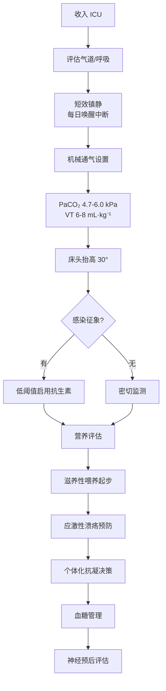

# ICU一般管理

## 本章目录

- [[ERC ESICM-PostCA-0-概述]]
- [[ERC ESICM-PostCA-5-神经保护与癫痫控制]]
- [[ERC ESICM-PostCA-8-神经预后预测]]

---

## 💊 1. 抗生素

> [!quote] 推荐
> 心脏骤停患者**不常规预防性使用**抗生素。然而，临床疑似肺炎时低阈值启用抗生素是合理的。

| 情况 | 推荐 |
|------|------|
| 常规预防 | 🔴 不推荐 |
| 临床疑似肺炎 | 🟡 低阈值启用 |

---

## 😴 2. 镇静与镇痛

> [!important] 核心推荐
> 对需机械通气的 ROSC 患者，使用 ==**短效镇静药物**== 并 ==**每日进行镇静中断**（sedation holds）==。

> [!tip] 临床价值
> 每日镇静中断有助于：
> - 更早进行可靠的神经功能评估
> - 减少镇静对预后判断的干扰
> - 减少呼吸机使用时间

| 药物选择 | 原则 |
|---------|------|
| 优选短效药物 | 丙泊酚、右美托咪定 |
| 避免长效药物 | 咪达唑仑（需使用时控制剂量）|

---

## 💉 3. 神经肌肉阻滞剂（NMBA）

| 场景 | 推荐 | 说明 |
|------|------|------|
| 常规使用 | 🔴 **强反对** | 不推荐心脏骤停昏迷患者常规使用 NMBA |
| 合并严重 ARDS + 低氧血症 | 🟡 可考虑 | 特定临床场景 |

> [!warning] 不推荐
> **不推荐**心脏骤停昏迷患者**常规使用**神经肌肉阻滞剂。

---

## 🛏️ 4. 体位

> [!note] 推荐
> 患者 ==**床头抬高 30°**==（head-up 30°）

---

## 🥛 5. 营养

> [!tip] 推荐
> 以 ==**低速率（滋养性喂养，trophic feeding）**== 开始胃肠道喂养，根据耐受情况逐渐增加。

| 喂养策略 | 说明 |
|---------|------|
| 初始 | trophic feeding（10-20 mL/h）|
| 耐受后 | 逐渐增加至目标热量 |
| 不耐受 | 考虑幽门后喂养 |

---

## 🩹 6. 应激性溃疡预防

> [!important] 推荐
> 心脏骤停患者上消化道溃疡发生率高，且常同时使用抗凝和抗血小板药物，**给予应激性溃疡预防**（尤其凝血功能障碍患者）。

| 危险因素 | 需要预防性治疗 |
|---------|-------------|
| 凝血功能障碍 | ✅ |
| 机械通气 >48h | ✅ |
| 既往溃疡病史 | ✅ |
| 多发伤 | ✅ |

---

## 🩸 7. 抗凝

> [!note] 推荐
> 心脏骤停患者的抗凝治疗应 ==**个体化**==，基于一般 ICU 推荐。

| 情况 | 处理 |
|------|------|
| 合并房颤 | 评估脑卒中风险后抗凝 |
| ACS + PCI 术后 | 双联抗血小板治疗（DAPT）|
| 一般情况 | 个体化决策 |

---

## 🩺 8. 血糖管理

> [!note] 推荐
> 使用 ==**标准血糖管理方案**== 控制成人 ROSC 后血糖。

| 血糖目标 | 说明 |
|---------|------|
| 参考 ICU 常规 | 通常 7.8-10.0 mmol/L |
| 避免低血糖 | < 6.0 mmol/L 需警惕 |

---

## 🗂️ 9. ICU管理速查

---

## 相关条目

- [[ERC ESICM-PostCA-0-概述]] — 2021 vs 2025 ICU管理变化
- [[ERC ESICM-PostCA-5-神经保护与癫痫控制]] — 镇静与癫痫管理
- [[ERC ESICM-PostCA-8-神经预后预测]] — 镇静对神经预后评估的影响
- [[SCCM-ICU PADIS-0-概述]] — PADIS 镇静谵妄指南（可交叉参考）
- [[应激性溃疡/中华医学会重症医学分会/中华医学会-su-4-预防]] — 心脏骤停后ICU患者的应激性溃疡预防

**跨指南**
- [[上消化道出血/ACG/ACG-UGIB-3-内镜时机]]（消化道出血急性处理优先级与内镜时机）
- [[上消化道出血/ACG/ACG-UGIB-4-内镜止血]]（抗血小板药物与消化道出血止血冲突）