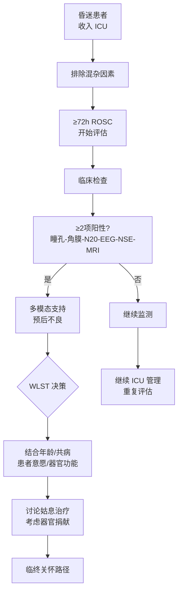

# 神经预后预测

> [!warning] ⚠️ 本章节为 POST-CA 指南最复杂章节
> 涵盖 7 个子节，是临床决策最关键的领域之一。

## 本章目录

- [[ERC ESICM-PostCA-0-概述]]
- [[ERC ESICM-PostCA-5-神经保护与癫痫控制]]
- [[ERC ESICM-PostCA-6-体温控制]]
- [[ERC ESICM-PostCA-7-ICU一般管理]]

---

## 🧠 1. 一般原则

> [!important] 核心推荐
> 对心脏骤停后昏迷患者，神经预后评估应使用**临床检查 + 电生理 + 生物标志物 + 影像**==多模态策略==。

> [!tip] 关键原则
> **单一预测指标无法 100% 准确**。使用多模态策略，避免单一致命性判断。

### 混杂因素必须排除

| 混杂因素 | 影响 |
|---------|------|
| 镇痛/镇静药物残留 | 可误判为神经损伤 |
| 神经肌肉阻滞剂 | 影响临床检查 |
| 低温治疗 | 影响 EEG 和临床判断 |
| 低血压（MAP < 60 mmHg）| 加重脑损伤 |
| 低血糖 / 高血糖 | 影响意识水平 |
| 脓毒症 | 影响 EEG 和临床判断 |

---

## 🖐️ 2. 临床检查（Clinical Examination）

> [!note] 推荐
> 对昏迷患者 ==**每日进行神经检查**==。

> [!warning] 推荐
> 在 ROSC 后 ==**≥ 72 小时**== 对不能遵命（GCS 运动评分 <6）的患者进行神经预后评估。

### 预后不良指标（≥72h ROSC）

| 检查项目 | 预后意义 |
|---------|---------|
| 🔴 双侧瞳孔光反射消失 | 预后不良 |
| 🔴 双侧角膜反射消失 | 预后不良 |
| 🔴 96h 内出现肌阵挛 尤其是 72h 内状态肌阵挛 | 预后不良 |

> [!tip] 2025 更新
> 2021版肌阵挛时间节点未明确；2025版明确为 ==**72h 内状态肌阵挛**== 是预后不良的独立指标。

---

## 📈 3. 神经电生理

### 3.1 脑电图（EEG）

> [!note] 推荐
> ROSC 后 ==**第 1 天**== 即开始 EEG 监测以判断预后和检测癫痫活动。

| EEG 模式 | 时间节点 | 预后意义 |
|---------|---------|---------|
| 🔴 抑制背景 / 爆发抑制 （"高度恶性"模式）| >24h ROSC | **预后不良准确指标** |
| 🔴 抑制 + 周期性放电 | >24h ROSC | **预后不良** |
| 🟢 正常背景 / 反应性 | 任意时间 | 可能预后良好（需结合多模态）|

> [!example] 肌阵挛 + EEG
> 对肌阵挛患者同时记录 EEG，识别癫痫样活动或良性 EEG 背景（提示可能神经恢复）。

### 3.2 体感诱发电位（SSEP）

> [!note] 推荐
> 双侧 ==**N20 皮质电位消失**== 提示心脏骤停后预后不良。

> [!warning] 注意
> EEG 和 SSEP 结果应始终结合临床检查综合判断。进行 SSEP 时建议使用神经肌肉阻滞剂消除肌电干扰。

---

## 🧪 4. 生物标志物

### 4.1 神经元特异性烯醇化酶（NSE）

> [!important] 推荐
> 使用 ==**连续 NSE 测量**==（24h、48h、72h）预测心脏骤停后预后。

| NSE 趋势 | 临床意义 |
|---------|---------|
| 48h 和 72h 持续高水平 | ⚠️ 预后不良 |
| 24-48h 或 24/48-72h 进行性升高 | ⚠️ 预后不良 |
| NSE > 60 mg/L | ⚠️ 高度提示不良预后 |

> [!tip] 注意事项
> - 进行连续采样（24h、48h、72h）以检测趋势
> - 溶血可导致 NSE 假性升高，需结合趋势判断

### 4.2 神经丝轻链（NfL）等

> [!warning] 不推荐
> **不推荐**使用神经丝轻链（Neurofilament light chain, NfL）预测心脏骤停预后——目前缺乏一致的阈值，且证据主要基于研究用检测方法。

---

## 🧠 5. 影像

> [!note] 推荐
> 使用 ==**脑影像（CT/MRI）**== 预测心脏骤停后不良神经预后。影像应由具有相关经验的人员评估。

| 影像发现 | 预后意义 |
|---------|---------|
| 🔴 脑 CT 灰白质比值（GM/WM）显著降低 | 预后不良 |
| 🔴 脑 MRI DWI 广泛扩散受限 | 预后不良 |
| 🟢 无明确 HIBI 征象 | 72h 后复查 |

> [!tip] 远程医疗
> 基层医院缺乏神经放射专业时，可考虑远程医疗影像会诊。

> [!warning] 复查指征
> 首次脑 CT 在 72h±6h ROSC 时未显示 HIBI 征象，应**复查脑 CT**。

---

## 🔀 6. 多模态预后策略（Fig.5）

> [!important] 多模态原则
> 排除主要混杂因素后，从**临床检查**开始多模态预后评估。

### 预后不良预测（≥2 项阳性）

| 指标 | 检测时间 | 证据等级 |
|------|---------|---------|
| 双侧瞳孔光反射消失 | 72h | 高 |
| 双侧角膜反射消失 | 72h | 高 |
| 双侧 N20 SSEP 消失 | 24h | 高 |
| 高度恶性 EEG（抑制/爆发抑制）| >24h | 高 |
| NSE > 60 mg/L | 48h 和/或 72h | 高 |
| 状态肌阵挛 | 72h | 高 |
| 脑 CT/MRI 广泛 HIBI | 72h±6h | 高 |

> [!tip] 预后良好提示
> 当出现瞳孔反射存在、角膜反射正常、EEG 反应性正常时，多模态评估提示可能预后良好。

---

## 🛑 7. 生命维持治疗撤退（WLST）

> [!warning] 重要区分
> 将 **WLST 讨论** 与 **神经预后评估讨论** 区分开来。

> [!important] WLST 应考虑因素
> 除了神经预后，还应考虑：==年龄、共病、整体器官功能、患者偏好==。

| 决策要素 | 说明 |
|---------|------|
| 神经预后 | 多模态评估结果（仅是决策因素之一）|
| 患者意愿 | 已知或推测的患者偏好 |
| 年龄与共病 | 整体生理储备 |
| 器官功能 | 非神经系统的功能状态 |

> [!tip] 决策后行动
> WLST 决策后，采用结构化方法将治疗从积极治疗转变为临终姑息治疗，同时考虑器官捐献（见 [[ERC ESICM-PostCA-9-康复与随访]]）。

---

## 📊 8. 神经预后评估全流程

---

## 相关条目

- [[ERC ESICM-PostCA-0-概述]] — 2021 vs 2025 神经预后变化
- [[ERC ESICM-PostCA-5-神经保护与癫痫控制]] — EEG 癫痫监测
- [[ERC ESICM-PostCA-6-体温控制]] — 低温对神经预后影响
- [[ERC ESICM-PostCA-7-ICU一般管理]] — ICU 常规管理
- [[ERC ESICM-PostCA-11-证据支撑]] — 详细证据
- [[神经重症镇痛镇静/NCHN/NCHN-神经重症镇痛镇静-2-监测]] — NCHN共识Rec 17-20：多模态监测（EEG/SSEPs）与神经预后评估流程