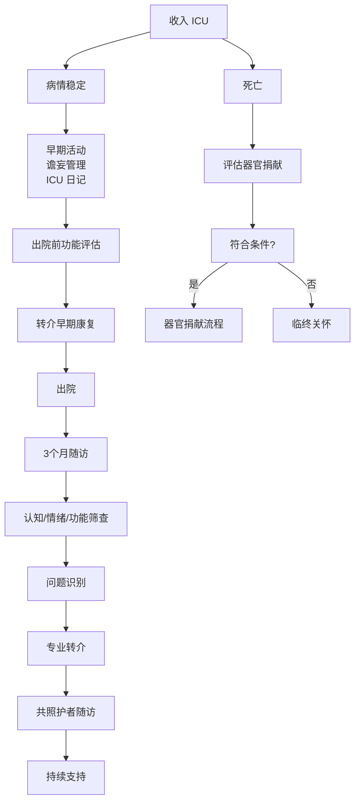

# 康复与随访

## 本章目录

- [[ERC ESICM-PostCA-0-概述]]
- [[ERC ESICM-PostCA-8-神经预后预测]]
- [[ERC ESICM-PostCA-10-不明原因CA与心脏骤停中心]]

---

## 🏥 1. 住院期间康复

> [!important] 核心推荐
> 实施 ==**早期活动 + 谵妄管理 + ICU 日记**==。

| 干预措施 | 内容 | 价值 |
|---------|------|------|
| 早期活动 | 病情稳定后尽早开始 | 减少 ICU 获得性肌无力 |
| 谵妄管理 | ABCDEF bundle | 减少谵妄发生率 |
| ICU 日记 | 记录每日事件 | 帮助患者/家属理解病程 |

> [!tip] 功能评估
> 出院前进行功能评估，识别康复需求并转介早期康复。

---

## 🫀 2. 心脏康复

> [!note] 推荐
> 根据心脏骤停 ==**病因**== 提供相应的 ==**心脏康复==。

| 病因 | 心脏康复内容 |
|------|-------------|
| 冠心病 / 心肌梗死 | 心脏康复 Phase II/III |
| 遗传性心律失常 | 心律失常专项康复 |
| 其他心脏原因 | 根据具体疾病定制 |

---

## 📅 3. 出院后随访（3个月）

> [!important] 核心推荐
> 在出院后 ==**3 个月内**== 组织心脏骤停存活者随访。

### 随访内容

| 领域 | 筛查内容 | 工具 |
|------|---------|------|
| 🧠 认知 | 记忆力、注意力、执行功能 | MoCA |
| 😊 情绪 | 抑郁、焦虑、创伤后应激 | HADS |
| 😴 疲劳 | 严重程度及对生活影响 | 视觉模拟量表 |
| 💪 功能 | 日常生活能力（ADL/IADL）| Barthel 指数 |
| 👥 社会参与 | 返回工作、社会角色 | 自拟问卷 |

---

## 👨‍👩‍👧 4. 共照护者（Co-survivors）支持

> [!tip] 2025 重点新增
> **邀请共照护者参加随访**；主动询问其情绪问题及生活角色受影响情况。

| 对象 | 关注点 |
|------|--------|
| 配偶/伴侣 | 情绪负担、照顾压力 |
| 子女 | 父母心脏骤停的心理冲击 |
| 其他家庭成员 | 家庭功能影响 |

> [!example] 随访问询示例
> "在照顾您的家人期间，您自己是否有情绪困扰？生活和工作是否受到影响？"

---

## ⚰️ 5. 器官捐献

> [!danger] 强推荐
> 所有 ROSC 后最终进展至死亡的患者，均应 ==**评估器官捐献**==。

### 器官捐献路径

| 患者状态 | 决策路径 |
|---------|---------|
| 脑死亡（符合标准）| 器官捐献标准流程 |
| 昏迷 + WLST 决策后 | 临终关怀同时考虑器官捐献 |
| 心跳停止后死亡 | 可考虑心跳停止后器官捐献（DCD）|

> [!warning] 法律合规
> 所有决策必须遵循当地法律法规。

> [!note] 登记报告
> 心脏骤停登记应报告器官捐献活动（2025 新增要求）。

---

## 📋 6. 康复与随访全流程

---

## 相关条目

- [[ERC ESICM-PostCA-0-概述]] — 2021 vs 2025 康复/器官捐献变化
- [[ERC ESICM-PostCA-8-神经预后预测]] — WLST 与器官捐献决策衔接
- [[ERC ESICM-PostCA-11-证据支撑]] — 证据支撑